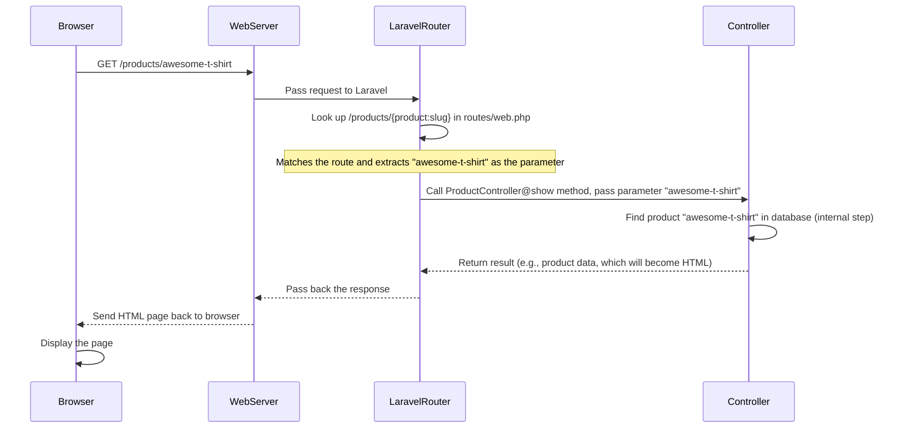

# Chapter 1: Routing

Welcome to your journey building an e-commerce website with Laravel! In this first chapter, we'll explore a fundamental concept: **Routing**.

Think of a website like a big house with many rooms. When you visit a website, you're essentially telling your browser which "room" you want to go to. The **routing system** is like the map or directory that guides you to the correct room (the right page or functionality).

Without routing, your website wouldn't know what to show when someone types `yourwebsite.com/products` or clicks a link to `yourwebsite.com/about`. Routing is the key that connects a web address (URL) to the specific code that should handle that request.

In simpler terms, routing answers the question: **"When a user goes to THIS URL, what code should run?"**

## How Routing Works (The Basics)

In Laravel, you define your routes in files located in the `routes` directory. For web pages your users see in their browser, you'll primarily work with the `routes/web.php` file.

Let's look at a very simple route definition from our `routes/web.php` file:

```php
// File: routes/web.php (simplified snippet)

use App\Http\Controllers\HomeController;
use Illuminate\Support\Facades\Route;

Route::get('/', [HomeController::class, 'index'])->name('home');
```

Let's break this down:

1.  `Route::get('/')`: This tells Laravel, "When someone makes a `GET` request to the root URL (`/`), I want you to do something." A `GET` request is the most common type, used when you simply visit a page in your browser. The `/` symbol represents the very front page of your website (like `yourwebsite.com/`).
2.  `[HomeController::class, 'index']`: This part tells Laravel *what* to do. It says, "Go find the `HomeController` and run the method (a function inside a class) named `index`." We'll learn all about [Controllers](02_controllers_.md) in the next chapter, but for now, just know this is where the main logic lives.
3.  `->name('home')`: This is an optional, but very useful, part. It gives this specific route a name, `home`. Naming routes makes it much easier to generate links within your application. Instead of typing `/`, you can just refer to the route by its name (`home`).

So, this one line of code sets up your website's homepage! When someone visits `yourwebsite.com`, Laravel's routing system sees the `GET` request for `/`, finds this route definition, and executes the `index` method inside the `HomeController`.

## Different Ways to Talk to the Server (HTTP Methods)

Web browsers and servers communicate using different "methods" or "verbs". The most common is `GET` (asking for information). But there are others used for different actions:

*   **`GET`**: Requesting data (like loading a page, viewing a product).
*   **`POST`**: Sending data to create something (like submitting a form to create a new account or add an item to a cart).
*   **`PATCH`** or **`PUT`**: Sending data to update something (like changing your profile information or updating the quantity in a cart).
*   **`DELETE`**: Asking the server to remove something (like removing an item from a cart or deleting a product).

Our `routes/web.php` file uses many of these:

```php
// File: routes/web.php (Cart Routes snippet)

// ... other routes above ...

Route::get('/cart', [CartController::class, 'index'])->name('cart.index'); // View the cart
Route::post('/cart/add/{product}', [CartController::class, 'add'])->name('cart.add'); // Add something to cart
Route::patch('/cart/update/{id}', [CartController::class, 'update'])->name('cart.update'); // Update quantity
Route::delete('/cart/remove/{id}', [CartController::class, 'remove'])->name('cart.remove'); // Remove item

// ... other routes below ...
```

See how different methods (`get`, `post`, `patch`, `delete`) are used for different actions, even if the URL path is similar? This is a standard way to design web interactions.

## Getting Information from the URL (Route Parameters)

Sometimes, the URL needs to include specific information, like the ID or "slug" (a friendly name in the URL) of a product you want to view. Route parameters allow you to capture these pieces of the URL.

Look at this route from `routes/web.php`:

```php
// File: routes/web.php (Product show route snippet)

// ... other routes above ...

Route::get('/products/{product:slug}', [ProductController::class, 'show'])->name('products.show');

// ... other routes below ...
```

Here's the breakdown:

1.  `Route::get('/products/{product:slug}')`: This route matches URLs like `/products/awesome-t-shirt` or `/products/fancy-gadget`.
2.  `{product:slug}`: This is the **route parameter**. The name inside the curly braces (`product`) becomes a variable that Laravel passes to the Controller method. The `:slug` part is a bit advanced for now, but it tells Laravel to look up a product based on its `slug` database column instead of its ID. For beginners, just know `{name}` captures a part of the URL.
3.  `[ProductController::class, 'show']`: Laravel will call the `show` method in the `ProductController` and pass the captured value (`awesome-t-shirt` or `fancy-gadget`) to it. The `show` method can then use this value to find the correct product in the database and display its details.

This is how your website can show different product pages using just one route definition!

## Organizing Your Routes (Grouping)

As your website grows, the `routes/web.php` file can get long. Laravel allows you to group routes that share common attributes, like needing the user to be logged in, or having a common URL prefix (like all admin pages starting with `/admin`).

Here's an example of grouping routes that require a user to be authenticated (logged in):

```php
// File: routes/web.php (Authenticated Routes snippet)

// ... other routes above ...

Route::middleware('auth')->group(function () {
    Route::get('/profile', [ProfileController::class, 'edit'])->name('profile.edit');
    Route::patch('/profile', [ProfileController::class, 'update'])->name('profile.update');
    Route::delete('/profile', [ProfileController::class, 'destroy'])->name('profile.destroy');

    // Checkout Routes
    Route::get('/checkout', [CheckoutController::class, 'index'])->name('checkout.index');
    Route::post('/checkout', [CheckoutController::class, 'store'])->name('checkout.store');

    // Order Routes
    Route::get('/orders', [OrderController::class, 'index'])->name('orders.index');
    Route::get('/orders/{order}', [OrderController::class, 'show'])->name('orders.show');
});

// ... other routes below ...
```

And an example for admin routes:

```php
// File: routes/web.php (Admin Routes snippet)

// ... other routes above ...

Route::middleware(['auth', 'admin'])->prefix('admin')->name('admin.')->group(function () {
    Route::get('/', function () {
        return view('admin.dashboard');
    })->name('dashboard');

    // Resource routes (explained later)
    Route::resource('categories', AdminCategoryController::class);
    Route::resource('products', AdminProductController::class);
    Route::resource('orders', AdminOrderController::class)->only(['index', 'show', 'update']);
});

// ... other routes below ...
```

*   `Route::middleware('auth')`: Applies the `auth` middleware to all routes inside the group. Middleware are like checkpoints that requests must pass through (e.g., check if the user is logged in). We'll cover [Admin Middleware](08_admin_middleware_.md) later.
*   `->prefix('admin')`: Adds `/admin` to the beginning of every URL inside this group. So, `/categories` inside the group becomes `/admin/categories`.
*   `->name('admin.')`: Adds `admin.` to the beginning of every route name inside this group. So, a route named `dashboard` inside the group becomes `admin.dashboard`.

Grouping keeps your `routes/web.php` file clean and organized!

## How it Works Under the Hood (Simplified)

When you type a URL like `yourwebsite.com/products/awesome-t-shirt` into your browser and hit Enter, here's a simplified look at what happens:



The core idea is that Laravel's Router (`LaravelRouter` in the diagram) is the traffic cop. It receives the incoming request and uses the rules you defined in your route files (`routes/web.php`, `routes/auth.php`, etc.) to decide which specific piece of code (usually a [Controller](02_controllers_.md) method) should handle that request.

## Looking at the Code Files

Let's briefly look at where these route definitions live in our project.

The main web routes are in `routes/web.php`:

```php
// File: routes/web.php

<?php

use App\Http\Controllers\HomeController;
// ... other Controller imports ...
use Illuminate\Support\Facades\Route;

// All your web page routes go here...

Route::get('/', [HomeController::class, 'index'])->name('home');
Route::get('/products', [ProductController::class, 'index'])->name('products.index');
// ... many more routes ...

// Authenticated group
Route::middleware('auth')->group(function () {
    // ... routes requiring login ...
});

// Admin group
Route::middleware(['auth', 'admin'])->prefix('admin')->name('admin.')->group(function () {
    // ... admin routes ...
});

// This line includes routes from another file
require __DIR__.'/auth.php';
```

Notice the `use` statements at the top. These lines import the "addresses" of the Controllers so the `Route::get(...)` definitions know where to find them.

The `require __DIR__.'/auth.php';` line at the bottom includes routes related to user authentication (login, registration, password reset) from a separate file:

```php
// File: routes/auth.php

<?php

use App\Http\Controllers\Auth\AuthenticatedSessionController;
// ... other Auth Controller imports ...
use Illuminate\Support\Facades\Route;

// Routes for guests (not logged in)
Route::middleware('guest')->group(function () {
    Route::get('register', [RegisteredUserController::class, 'create'])->name('register');
    Route::post('register', [RegisteredUserController::class, 'store']);
    // ... other guest routes ...
});

// Routes for logged in users
Route::middleware('auth')->group(function () {
    Route::get('verify-email', EmailVerificationPromptController::class)->name('verification.notice');
    // ... other authenticated routes ...
    Route::post('logout', [AuthenticatedSessionController::class, 'destroy'])->name('logout');
});
```

Keeping authentication routes in `routes/auth.php` helps organize the project, but they work just like the routes in `routes/web.php`.

## Conclusion

Routing is the first step in understanding how your Laravel application works. It's the system that takes an incoming web request (a URL and an HTTP method) and directs it to the appropriate code that will handle it. You learned about defining basic routes, using different HTTP methods, capturing data from the URL using parameters, and organizing routes with groups.

Now that you know *where* the requests go, the next logical step is to understand *what happens* when they get there. That's handled by [Controllers](02_controllers_.md)!

[Next Chapter: Controllers](02_controllers_.md)

---
