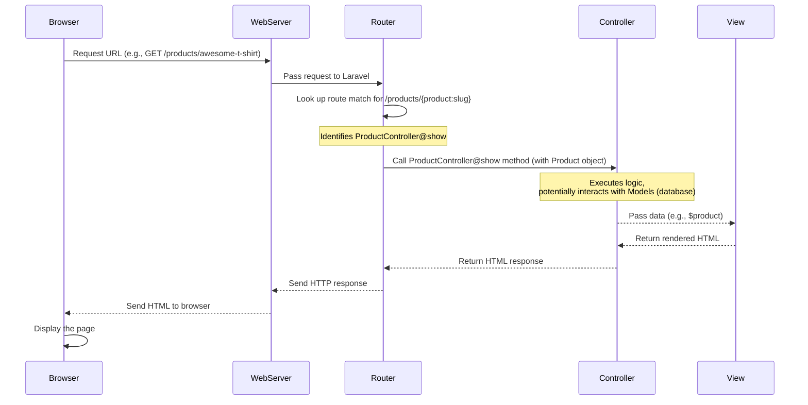

# Chapter 2: Controllers

Welcome back! In the previous chapter, [Routing](01_routing_.md), we learned how Laravel's routing system acts as the traffic cop, taking an incoming web request (a URL and method like `GET` or `POST`) and figuring out which specific piece of code should handle it.

But once the route has done its job, where does the request go? It gets handed over to a **Controller**.

Think of it like this:
*   **Routing** is the address and directions to a specific office in a building.
*   A **Controller** is the manager *in* that office who receives your request, figures out exactly what needs to be done, delegates tasks (like getting files from storage, processing calculations), and then prepares the final response (like a report or form) to give back to you.

Without Controllers, your route definitions would become cluttered with lots of complex logic. Controllers provide a clean, organized place to put the code that actually *does* things in response to a user's request.

In simpler terms, a Controller answers the question: **"Okay, I've arrived at this specific URL (thanks, Router!). NOW what exactly should happen?"**

## What Controllers Do

Controllers are the **central coordination points** for incoming web requests. Their main responsibilities include:

1.  **Receiving the Request:** The Router passes the details of the incoming request (including any data sent by the user or parameters from the URL) to the appropriate Controller method.
2.  **Processing Input:** If the user submitted a form or provided data in the URL, the Controller method can access and validate this input.
3.  **Interacting with Data (Models):** Controllers often need to get information from your database or save new information. They do this by interacting with [Eloquent Models](04_eloquent_models_.md) (we'll cover these in a later chapter!).
4.  **Performing Business Logic:** This is where the "brains" of your application live. A Controller might calculate a cart total, check if a user is an admin, update stock levels, or perform any other necessary steps based on the request.
5.  **Preparing the Response:** After doing its work, the Controller decides what to send back to the user. This is most commonly:
    *   Displaying a webpage (using a [Blade View](03_blade_views_.md)).
    *   Redirecting the user to another page.
    *   Returning data (like JSON for an API).

## Anatomy of a Controller

In Laravel, Controllers are PHP classes that usually live inside the `app/Http/Controllers` directory.

Let's look at a very basic Controller structure:

```php
// File: app/Http/Controllers/MySimpleController.php

<?php

namespace App\Http\Controllers;

use Illuminate\Http\Request; // Used to access request data

class MySimpleController extends Controller // All controllers extend this base class
{
    // A method to handle a specific action
    public function index()
    {
        // 1. Process input (none needed here)
        // 2. Interact with Models (none needed here)
        // 3. Perform business logic (none needed here)

        // 4. Prepare response: Return a simple message
        return "Hello from MySimpleController!";
    }

    // Another method, maybe for showing something specific
    public function show($id) // Accepts a parameter, e.g., from a route {id}
    {
        // 1. Process input ($id is the input here)
        // 2. Interact with Models (e.g., find item with this $id)
        // $item = \App\Models\Item::find($id); // Imagine this line for now

        // 3. Perform business logic (e.g., check if item exists)
        // if (!$item) { /* handle not found */ }

        // 4. Prepare response: Return a message using the parameter
        return "Details for item ID: " . $id;
    }
}
```

Key points:
*   It's a PHP class.
*   It `extends Controller` (Laravel's base controller class).
*   It has public methods (`index`, `show`). Each method typically handles a single type of request directed to this controller.
*   The methods contain the logic.

You would then link these methods to routes in your `routes/web.php`:

```php
// File: routes/web.php (snippet)

use App\Http\Controllers\MySimpleController;
use Illuminate\Support\Facades\Route;

Route::get('/hello', [MySimpleController::class, 'index']); // Calls the index method
Route::get('/items/{id}', [MySimpleController::class, 'show']); // Calls the show method, passing {id}
```

When a user visits `/hello`, the router calls `MySimpleController@index`. When they visit `/items/5`, the router calls `MySimpleController@show` and passes `5` as the `$id` parameter.

## Controllers in Our E-commerce Project

Let's see how Controllers are used in our `laravel_ecommerce` project.

### Use Case: Showing a Single Product Page

Remember the route we saw in Chapter 1 for viewing a product?

```php
// File: routes/web.php (Product show route snippet)

Route::get('/products/{product:slug}', [ProductController::class, 'show'])->name('products.show');
```

This route directs requests for `/products/some-product-slug` to the `show` method of the `ProductController`. Let's look at a simplified version of that method:

```php
// File: app/Http/Controllers/ProductController.php (simplified snippet)

<?php

namespace App\Http\Controllers;

use App\Models\Product; // We'll use the Product Model
use Illuminate\Http\Request; // Need this if we access request data

class ProductController extends Controller // It extends Controller
{
    // ... other methods like index() ...

    // The 'show' method that handles viewing a single product
    public function show(Product $product) // Laravel finds the Product based on the route {product:slug}
    {
        // 1. Process input: Laravel automatically found the Product object ($product)

        // 2. Interact with Models: We already have the $product Model instance!
        //    (Laravel's "Route Model Binding" did this magic!)
        //    We might load related data like its category if needed (loaded implicitly by Model setup)

        // 3. Perform business logic: (Original code has checks, we skip for simplicity)
        //    e.g., ensure product is active

        // 4. Prepare response: Tell Laravel to show the 'products.show' view,
        //    and pass the $product variable to it.
        return view('products.show', compact('product'));
    }

    // ... other methods ...
}
```

**Explanation:**

*   The `show` method receives a variable `$product`. Because we hinted the type (`Product`) and the route parameter was named `product`, Laravel automatically looks up the `Product` from the database that matches the `{product:slug}` in the URL and passes the *actual* `Product` object to the method. This is called **Route Model Binding** and is very powerful! It saves you from writing `Product::where('slug', $slug)->firstOrFail();` inside the method.
*   The core job of this method is simple: take the `$product` object it received, and return a **[View](03_blade_views_.md)**.
*   `return view('products.show', compact('product'));` tells Laravel:
    *   "Find the view file located at `resources/views/products/show.blade.php`." ([Blade Views](03_blade_views_.md) in Chapter 3).
    *   `compact('product')` is a PHP function that creates an array `['product' => $product]`. This makes the `$product` variable available *inside* the `products/show.blade.php` file, so the view can display the product's name, price, description, etc.

So, the `ProductController@show` method's job is just to receive the correct product object (handled by Laravel's binding) and hand it over to the view template that knows how to display product details.

### Use Case: Listing All Products

Now, let's look at the route for the product listing page:

```php
// File: routes/web.php (Product index route snippet)

Route::get('/products', [ProductController::class, 'index'])->name('products.index');
```

This route goes to the `index` method of the `ProductController`. Here's a simplified look:

```php
// File: app/Http/Controllers/ProductController.php (simplified snippet)

<?php

namespace App\Http\Controllers;

use App\Models\Product; // We'll use the Product Model
use Illuminate\Http\Request; // We'll need the Request object here

class ProductController extends Controller
{
    // The 'index' method that handles listing products
    public function index(Request $request) // We receive the Request object
    {
        // 1. Process input: The Request object can hold search terms, filters, etc.
        //    $search = $request->input('search'); // How you'd get a search term

        // 2. Interact with Models: Get products from the database
        $products = Product::where('is_active', true)->get(); // Get all active products

        // 3. Perform business logic: (Original code has lots of filtering/sorting)
        //    e.g., filter products based on $search or other $request inputs

        // 4. Prepare response: Tell Laravel to show the 'products.index' view,
        //    and pass the list of products to it.
        return view('products.index', compact('products'));
    }

    // ... other methods ...
}
```

**Explanation:**

*   The `index` method receives an instance of `Illuminate\Http\Request`. This object contains *all* the details about the incoming request, including any data submitted in forms or query parameters in the URL (like `/products?search=shirt&category=clothing`). You use `$request->input('fieldName')` or `$request->get('fieldName')` to access this data.
*   It uses the `Product::where('is_active', true)->get();` line to fetch data from the database using the `Product` Model. The `get()` method executes the query and returns a collection of `Product` objects.
*   It then returns the `products.index` view, passing the `$products` collection to it using `compact('products')`. The view will then loop through this collection to display each product in a list.

These two examples show the core pattern: **Controller method receives request/data -> uses Models to get/save data -> returns a View (or redirects, etc.)**.

### Common Controller Actions

Laravel encourages using consistent method names for common web actions. For resources (like `products`, `categories`, `orders`), you'll often see these methods:

| Method Name | What it does (typically)                     | HTTP Method | Route Example (`/photos`)       | Maps to Form Action |
| :---------- | :------------------------------------------- | :---------- | :------------------------------ | :------------------ |
| `index`     | Display a listing of the resource.           | `GET`       | `/photos`                       |                     |
| `create`    | Show the form to create a new resource.      | `GET`       | `/photos/create`                |                     |
| `store`     | Store a newly created resource in storage.   | `POST`      | `/photos`                       | Form Submission     |
| `show`      | Display the specified resource.              | `GET`       | `/photos/{photo}`               |                     |
| `edit`      | Show the form for editing the specified resource. | `GET`       | `/photos/{photo}/edit`          |                     |
| `update`    | Update the specified resource in storage.    | `PUT`/`PATCH` | `/photos/{photo}`               | Form Submission     |
| `destroy`   | Remove the specified resource from storage.  | `DELETE`    | `/photos/{photo}`               | Form Submission     |

Our project uses many Controllers that follow this pattern, especially the admin Controllers like `AdminProductController` and `AdminCategoryController`.

Remember the `Route::resource` definition from Chapter 1?

```php
// File: routes/web.php (Admin Resource Routes snippet)

Route::middleware(['auth', 'admin'])->prefix('admin')->name('admin.')->group(function () {
    // ... other admin routes ...
    Route::resource('categories', AdminCategoryController::class); // Creates routes for index, create, store, show, edit, update, destroy
    Route::resource('products', AdminProductController::class);   // Creates routes for index, create, store, show, edit, update, destroy
    // ...
});
```

`Route::resource` automatically sets up routes that map URLs and HTTP methods to these standard Controller methods, saving you from writing out each route individually!

## How it Works Under the Hood (Simplified)

Let's revisit the request flow diagram from Chapter 1 and add the Controller's role:



This diagram shows that the Controller is the crucial link after the Router has identified the handler. It's where the application logic happens before the response (often HTML generated by a View) is sent back.

## Looking at the Code Files

All the Controllers for your web routes are in the `app/Http/Controllers` directory.

You'll see various Controller files:

*   `HomeController.php`: Handles the homepage (`/`).
*   `ProductController.php`: Handles listing and showing individual products (`/products`, `/products/{slug}`).
*   `CartController.php`: Handles adding, updating, and removing items from the cart (`/cart`).
*   `CheckoutController.php`: Handles the checkout process (`/checkout`).
*   `OrderController.php`: Handles displaying a user's orders (`/orders`).
*   `Auth/`: A subdirectory containing Controllers for authentication (login, register, etc.).
*   `Admin/`: A subdirectory for Controllers that handle the admin panel logic (like `AdminProductController`, `AdminCategoryController`).

Open one of these files, like `app/Http/Controllers/HomeController.php`.

```php
// File: app/Http/Controllers/HomeController.php

<?php

namespace App\Http\Controllers; // Tells PHP where this file belongs

use App\Models\Product; // We'll use the Product Model
use App\Models\Category; // We'll use the Category Model
use Illuminate\Http\Request;

class HomeController extends Controller // Standard Controller setup
{
    // Handles GET / route
    public function index()
    {
        // Interact with Models to get data for the homepage
        $featuredProducts = Product::where('is_featured', true)
            ->where('is_active', true)
            ->with('category') // Load related category data
            ->take(8) // Get only 8 products
            ->get();

        $categories = Category::where('is_active', true)
            ->withCount('products') // Count products in each category
            ->take(6)
            ->get();

        $latestProducts = Product::where('is_active', true)
            ->with('category')
            ->latest() // Order by creation date (latest first)
            ->take(8)
            ->get();

        // Return the 'home' view and pass all the data we fetched
        return view('home', compact('featuredProducts', 'categories', 'latestProducts'));
    }
}
```

As you can see, the `HomeController`'s `index` method is responsible for fetching various data needed for the homepage (featured products, categories, latest products) using the `Product` and `Category` [Eloquent Models](04_eloquent_models_.md) and then returning the `home` [Blade View](03_blade_views_.md) with that data.

Controllers are where you connect the incoming request to the data you need and the view you want to show!

## Conclusion

Controllers are fundamental building blocks in Laravel. They serve as the crucial intermediary between the routing system and the rest of your application's logic, coordinating actions like fetching data, performing calculations, and deciding which page to display. You've learned how they receive requests, interact with (what will become) your [Eloquent Models](04_eloquent_models_.md), and prepare responses, often by returning a [Blade View](03_blade_views_.md).

Now that you know how Controllers process requests and gather data, the next step is to understand how that data is actually displayed to the user. That's the job of [Blade Views](03_blade_views_.md)!

[Next Chapter: Blade Views](03_blade_views_.md)

---
