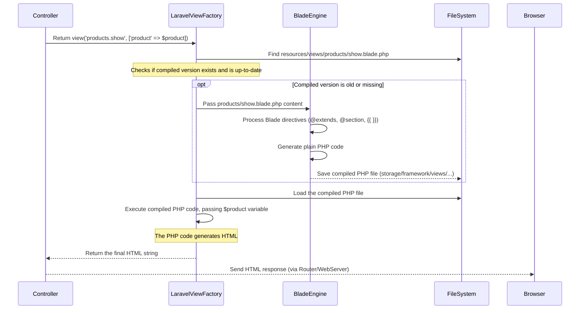

# Chapter 3: Blade Views

Welcome back to building your e-commerce site with Laravel! In the last chapter, [Controllers](02_controllers_.md), we learned how Controllers act as the central hub, receiving requests (thanks to the Router), fetching necessary data (we'll see *how* they get data in the next chapter!), and then deciding what response to send back.

Most of the time, the response a Controller sends back is a beautifully formatted webpage that the user sees in their browser. But how do we create these webpages using the data the Controller has gathered?

This is where **Views** come in.

Think of a Controller as the kitchen chef who prepares all the ingredients (the data). A **View** is like the dining room waiter who takes those prepared ingredients and arranges them nicely on a plate (the HTML page) to serve to the customer (the user's browser).

Without Views, your Controller methods would become a messy mix of PHP logic *and* tons of HTML code mixed together. Views provide a clean place to put all your HTML templates, separate from the application logic.

In simpler terms, Views answer the question: **"Okay, the Controller has the data. How should I display it as an HTML page?"**

## Introducing Blade

Laravel uses a templating engine called **Blade**. Blade allows you to write your view templates mostly in plain HTML, but with special shortcuts and features that make it easy to display data, run simple logic (like loops and conditions), and reuse parts of your page.

Blade view files end with the `.blade.php` extension (e.g., `home.blade.php`, `products/show.blade.php`). This tells Laravel that this file should be processed by the Blade engine before being sent to the user.

## Displaying Data

The most basic job of a View is to display data that was passed to it by the Controller.

Let's revisit the `ProductController@show` method we saw in the last chapter:

```php
// File: app/Http/Controllers/ProductController.php (snippet)
// ...
public function show(Product $product)
{
    // ... logic ...
    // Pass the $product variable to the view
    return view('products.show', compact('product'));
}
// ...
```

This method finds a product and then tells Laravel to render the `products.show` view, making the `$product` variable available inside that view file.

Now, let's look at a *simplified* part of the `resources/views/products/show.blade.php` file to see how it displays the product data:

```html
{{-- File: resources/views/products/show.blade.php (simplified snippet) --}}

<div class="product-details">
    {{-- Display the product name --}}
    <h1 class="h3 mb-3">{{ $product->name }}</h1>

    <div class="price mb-4">
        {{-- Display the price --}}
        <span class="h4 fw-bold">${{ number_format($product->price, 2) }}</span>
    </div>

    <div class="description mb-4">
        <h6>Description</h6>
        {{-- Display the description --}}
        <p>{{ $product->description }}</p>
    </div>
</div>
```

See those double curly braces `{{ }}`? That's the standard Blade syntax for **displaying content**.

*   `{{ $product->name }}`: This tells Blade to output the value of the `name` property of the `$product` variable. Laravel automatically makes variables passed from the Controller available in the view with the same name.
*   `{{ number_format($product->price, 2) }}`: You can even run PHP functions inside the curly braces! `number_format` makes the price look nice with two decimal places.

By default, `{{ }}` automatically escapes any HTML characters in the data to prevent security issues like Cross-Site Scripting (XSS). If you *know* your data is safe HTML and you want to render it as HTML (e.g., rich text from a content editor), you would use `{!! $variable !!}`. **Use `{{ }}` almost everywhere** unless you have a specific reason not to and are sure of the data's safety.

## Blade Control Structures (Running Simple Logic)

Views are primarily for presentation, but sometimes you need to do simple things like show something only if a condition is true, or loop through a list of items. Blade provides convenient directives (starting with `@`) for this, so you don't have to write raw PHP `if` and `foreach` statements mixed into your HTML.

### Conditionals (`@if`, `@else`, `@endif`)

You can use Blade's `@if` structure just like a PHP `if`:

```html
{{-- File: resources/views/products/show.blade.php (stock check snippet) --}}

<div class="stock-info mb-4">
    @if($product->stock_quantity > 0)
        {{-- This shows if the condition is true --}}
        <span class="text-success">In Stock ({{ $product->stock_quantity }} available)</span>
    @else
        {{-- This shows if the condition is false --}}
        <span class="text-danger">Out of Stock</span>
    @endif
</div>
```

Blade also supports `@elseif` and `@unless` (the opposite of `@if`). It's a clean way to handle simple display logic based on data.

### Loops (`@foreach`, `@empty`, `@endforeach`)

Looping is common, especially when displaying lists of things like products or cart items. Let's look at a snippet from `resources/views/products/index.blade.php`:

```html
{{-- File: resources/views/products/index.blade.php (products list snippet) --}}

<div class="row g-4">
    {{-- Loop through the $products variable passed from the Controller --}}
    @forelse($products as $product)
        <div class="col-lg-3 col-md-6">
            {{-- Display details for each $product --}}
            <h6>{{ $product->name }}</h6>
            <p>{{ Str::limit($product->short_description, 80) }}</p>
            <span>${{ number_format($product->current_price, 2) }}</span>
            <a href="{{ route('products.show', $product->slug) }}">View Details</a>
        </div>
    @empty
        {{-- This content shows if the $products collection is empty --}}
        <div class="col-12 text-center py-5">
            <h4>No products found</h4>
            <p>Try adjusting your search or filter criteria.</p>
        </div>
    @endforelse
</div>
```

The `@forelse` directive is great because it combines a `foreach` loop with an easy way to display something specific if the collection is empty (the `@empty` block).

Blade supports other loops like `@for` and `@while`, but `@foreach` is the most common for iterating over data from your Controller/Models.

## Reusing Parts of Your Page (`@include`)

Many websites have sections that appear on multiple pages, like headers, footers, or smaller components (like a form or a product card layout). Blade's `@include` directive lets you pull in content from another view file, making your templates more organized and easier to maintain.

Look at `resources/views/profile/edit.blade.php`:

```html
{{-- File: resources/views/profile/edit.blade.php (snippet) --}}

{{-- ... layout stuff (explained next) ... --}}

<div class="max-w-7xl mx-auto sm:px-6 lg:px-8 space-y-6">
    <div class="p-4 sm:p-8 bg-white shadow sm:rounded-lg">
        <div class="max-w-xl">
            {{-- Include the view file at 'resources/views/profile/partials/update-profile-information-form.blade.php' --}}
            @include('profile.partials.update-profile-information-form')
        </div>
    </div>

    <div class="p-4 sm:p-8 bg-white shadow sm:rounded-lg">
        <div class="max-w-xl">
            {{-- Include another partial view --}}
            @include('profile.partials.update-password-form')
        </div>
    </div>

    {{-- ... more includes ... --}}
</div>

{{-- ... layout stuff ... --}}
```

The `@include('profile.partials.update-profile-information-form')` line simply tells Blade to render the content of `resources/views/profile/partials/update-profile-information-form.blade.php` right there. This is a powerful way to break down complex pages into smaller, manageable, and reusable components.

## Reusing Page Structure (Layouts with `@extends`, `@section`, `@yield`)

Perhaps the most important feature of Blade is **template inheritance**. This allows you to define a main layout file (like a skeleton HTML page with placeholders) and then have other views fill in those placeholders. This is how you ensure a consistent header, footer, navigation, and overall structure across your entire site without copying and pasting HTML.

Our project uses `resources/views/layouts/app.blade.php` as the main layout file. A simplified version might look like this:

```html
{{-- File: resources/views/layouts/app.blade.php (simplified snippet) --}}

<!DOCTYPE html>
<html lang="{{ str_replace('_', '-', app()->getLocale()) }}">
<head>
    <meta charset="utf-8">
    <title>{{ config('app.name', 'Laravel E-Commerce') }} - @yield('title', 'Home')</title>
    {{-- ... other head elements (CSS, etc.) ... --}}
    @vite(['resources/css/app.scss', 'resources/js/app.js'])
</head>
<body>
    {{-- Navigation Bar (consistent on every page) --}}
    <nav>...</nav>

    {{-- This is the main content area. Child views will fill this in. --}}
    <main>
        @yield('content')
    </main>

    {{-- Footer (consistent on every page) --}}
    <footer>...</footer>

    {{-- ... scripts ... --}}
</body>
</html>
```

*   `@yield('title', 'Home')`: This defines a placeholder named `title`. Child views can provide content for this section. `'Home'` is a default value if the child view doesn't provide one.
*   `@yield('content')`: This defines the main placeholder for the page's unique content.

Now, let's look at how a page like `resources/views/home.blade.php` uses this layout:

```html
{{-- File: resources/views/home.blade.php --}}

{{-- This tells Blade to use layouts/app.blade.php as the base --}}
@extends('layouts.app')

{{-- This provides content for the 'title' section in the layout --}}
@section('title', 'Home')

{{-- This provides content for the 'content' section in the layout --}}
@section('content')

<!-- Hero Section - This is specific to the home page -->
<section class="hero-section">
    {{-- ... home page specific HTML and Blade ... --}}
</section>

<!-- Categories Section -->
<section class="py-5">
    {{-- ... home page specific HTML and Blade, using loops etc. ... --}}
    @forelse($categories as $category)
        {{-- ... display category ... --}}
    @empty
        {{-- ... handle empty ... --}}
    @endforelse
</section>

{{-- ... other sections like Featured Products, Latest Products ... --}}

@endsection {{-- Don't forget to close the section! --}}
```

*   `@extends('layouts.app')`: This is the first line in most view files. It tells Blade, "This view uses `layouts.app` as its parent layout." (`layouts.app` refers to `resources/views/layouts/app.blade.php`).
*   `@section('title', 'Home')`: This fills the `title` placeholder defined by `@yield('title')` in the parent layout with the string `'Home'`.
*   `@section('content') ... @endsection`: This block of code provides the content that will be placed into the `@yield('content')` placeholder in the parent layout.

When Laravel renders `home.blade.php`, Blade first processes the `@extends`, then finds the parent layout (`layouts/app.blade.php`), and finally injects the content from the `@section` blocks into the corresponding `@yield` placeholders.

You might also see `<x-app-layout>` used in files like `resources/views/profile/edit.blade.php`. This is a newer feature using **Blade Components**, often used in Laravel's authentication scaffolding (`laravel/breeze`, `laravel/jetstream`) to achieve a similar layout inheritance result but with a slightly different syntax (`<x-component-name>` and `<x-slot name="...">`). The `@extends/@section/@yield` approach is the more traditional and fundamental method of template inheritance in Blade.

## Where Views Live

All your Blade view files are stored in the `resources/views` directory of your Laravel project.

*   `resources/views/home.blade.php` (The homepage view)
*   `resources/views/products/index.blade.php` (The product listing page)
*   `resources/views/products/show.blade.php` (The single product detail page)
*   `resources/views/layouts/app.blade.php` (The main application layout)
*   `resources/views/cart/index.blade.php` (The shopping cart page)
*   `resources/views/checkout/index.blade.php` (The checkout page)
*   `resources/views/orders/index.blade.php` (The user's order history page)
*   `resources/views/admin/dashboard.blade.php` (Admin panel dashboard)

When a Controller calls `return view('products.show', ...)`, Laravel looks for the file `resources/views/products/show.blade.php`. The dot (`.`) in the view name corresponds to directory separators (`/`) within the `resources/views` folder.

## How it Works Under the Hood (Simplified)

When a Controller returns a view, here's a simplified look at what happens:



The key takeaway is that Blade templates (`.blade.php` files) are not executed directly. First, the **Blade Engine** compiles them into plain PHP code. This compiled code contains standard PHP `echo`, `if`, `foreach`, etc. This compilation step happens automatically whenever you modify a Blade file, or if the compiled version is missing. This makes Blade very fast because the overhead of parsing the `@` directives only happens when the file changes, not on every single request. The compiled PHP file is then executed to produce the final HTML output.

## Conclusion

Blade Views are the presentation layer of your Laravel application. They allow you to cleanly separate your HTML structure and display logic from your Controller's application logic. You've learned how to display data passed from Controllers using `{{ }}`, how to use simple control structures like `@if` and `@foreach`, how to include other view files with `@include`, and how to build consistent page structures using layout inheritance with `@extends`, `@section`, and `@yield`.

Now that you know how to define routes (Chapter 1) to direct requests, how Controllers (Chapter 2) handle those requests and prepare data, and how Views (Chapter 3) display that data, the next crucial piece is understanding where that data actually comes from. That's the job of [Eloquent Models](04_eloquent_models_.md)!

[Next Chapter: Eloquent Models](04_eloquent_models_.md)

---
