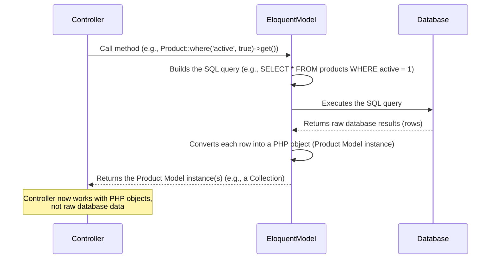

# Chapter 4: Eloquent Models

Welcome back, future e-commerce guru! In the last three chapters, we've built a solid foundation:
*   [Routing](01_routing_.md) tells Laravel *which* code should run for a given URL.
*   [Controllers](02_controllers_.md) are the managers that receive the request and decide *what* needs to be done.
*   [Blade Views](03_blade_views_.md) are the designers that take data and display it beautifully as HTML pages.

But wait... where does the actual product information, like names, prices, descriptions, or user details, come from? How do we get a list of products to show on the homepage, or find the specific product details for a product page?

We need a way for our Laravel application to talk to the database!

This is the job of **Eloquent Models**.

Think of Eloquent Models as the smart assistants who know exactly how to find, save, update, and delete information in your database. They act as a bridge between your PHP code and the database tables. Instead of writing complex, raw SQL queries (like `SELECT * FROM products WHERE is_active = true`), you use Model objects and their easy-to-read methods (like `Product::where('is_active', true)->get()`).

In simpler terms, Eloquent Models answer the question: **"How do I easily get data from the database or save data into it?"**

## What are Eloquent Models?

Eloquent is the name of Laravel's built-in *Object-Relational Mapper* (ORM). An ORM helps you interact with your database using an object-oriented approach (using objects in your PHP code) instead of writing SQL queries directly.

An **Eloquent Model** is essentially a PHP class that represents a single table in your database.

*   The `User` model typically represents the `users` table.
*   The `Product` model typically represents the `products` table.
*   The `Category` model typically represents the `categories` table.
*   And so on for other tables like `orders` and `order_items`.

Each instance (object) of a Model class represents a single row in its corresponding database table.

## Using Models to Interact with Data

Let's look at some fundamental things you can do with Eloquent Models.

### 1. Retrieving Data

Getting information out of the database is a very common task.

Imagine you need to display a list of all active products on the `/products` page. In Chapter 2, we saw the `ProductController@index` method handling this. Here's how it might get the product data using the `Product` model:

```php
// File: app/Http/Controllers/ProductController.php (snippet)

use App\Models\Product; // Import the Product Model

class ProductController extends Controller
{
    public function index(Request $request)
    {
        // Get all active products from the 'products' table
        $products = Product::where('is_active', true)->get();

        // Pass the collection of $products to the view
        return view('products.index', compact('products'));
    }
    // ...
}
```

Let's break down this key line: `$products = Product::where('is_active', true)->get();`

*   `Product::`: We are using the static methods provided by the `Product` Eloquent Model class.
*   `where('is_active', true)`: This is how you specify a condition, similar to the `WHERE` clause in SQL. It means "only consider products where the `is_active` column is true". You can chain multiple `where` clauses.
*   `->get()`: This executes the query that we've built (`where(...)`) and retrieves all the matching records from the database. It returns an **Eloquent Collection**, which is like a super-powered PHP array containing `Product` Model objects.

If you just wanted to get *all* products without any conditions, you could simply do:

```php
$allProducts = Product::all(); // Gets all records from the 'products' table
```

To find a single product by its primary key (usually the `id` column):

```php
// Find the product with ID 1
$product = Product::find(1);

// findOrFail will throw an error if the record isn't found,
// which is often useful to show a 404 page
$product = Product::findOrFail(1);
```

`find()` and `findOrFail()` return a single `Product` Model object (or `null` or an error), not a collection.

**Route Model Binding Revisited:** Remember in [Chapter 2](02_controllers_.md) how `ProductController@show` received a `Product $product` variable directly?

```php
// File: app/Http/Controllers/ProductController.php (snippet)
use App\Models\Product;

class ProductController extends Controller
{
    // Laravel automatically finds the Product model based on the route parameter
    public function show(Product $product)
    {
        // $product is already an instance of the Product Model,
        // representing the row from the database!
        return view('products.show', compact('product'));
    }
}
```

This is a powerful Eloquent feature called **Route Model Binding**. If your route parameter name matches a Model name (case-insensitive) and you type-hint the Model in your Controller method, Laravel automatically fetches the model instance for you! If the parameter is `{product:slug}`, it will find the product by its `slug` column instead of the ID, as defined in your route (Chapter 1). This saves you the step of writing `Product::where('slug', $slug)->firstOrFail();` inside your controller.

### 2. Creating Data

To add a new record to the database, you can create a new Model instance and then save it.

Imagine an admin creating a new category.

```php
use App\Models\Category; // Import the Category Model
use Illuminate\Http\Request;

// ... inside an AdminCategoryController method, perhaps 'store'
public function store(Request $request)
{
    // Get data from the form submission ($request)
    $data = $request->validate([
        'name' => 'required|string|max:255',
        'description' => 'nullable|string',
        // ... other validation rules
    ]);

    // Create a new Category model instance
    $category = new Category();

    // Set its properties using the validated data
    $category->name = $data['name'];
    $category->description = $data['description'];
    // Eloquent often handles created_at and updated_at automatically!

    // Save the model instance to the database (inserts a new row)
    $category->save();

    // ... redirect or return a response ...
}
```

Alternatively, you can use the `create()` method, which is shorter if you have lots of data. However, for security, you must define which fields are "fillable" using the `$fillable` property in your Model class (more on this below).

```php
use App\Models\Category;
use Illuminate\Http\Request;

// ... inside an AdminCategoryController method
public function store(Request $request)
{
    $data = $request->validate([
        'name' => 'required|string|max:255',
        'description' => 'nullable|string',
        // ...
    ]);

    // Create and save in one step (requires $fillable in the Category Model)
    $category = Category::create($data);

    // ...
}
```

### 3. Updating Data

To modify an existing record, you retrieve the Model instance, change its properties, and then call the `save()` method.

Imagine updating a product's price.

```php
use App\Models\Product;

// ... inside an AdminProductController method, perhaps 'update'
public function update(Request $request, Product $product) // Using Route Model Binding
{
    // Get updated data from the form ($request)
    $data = $request->validate([
        'price' => 'required|numeric|min:0',
        // ... other validation rules
    ]);

    // $product is already the Model instance we want to update
    $product->price = $data['price'];
    // Eloquent automatically updates the updated_at timestamp!

    // Save the changes to the database
    $product->save();

    // ... redirect or return a response ...
}
```

You can also use the `update()` method on a model instance, similar to `create()`:

```php
// Assuming $product is already fetched
$product->update([
    'price' => $request->input('price'),
    'description' => $request->input('description'),
    // ...
]);
```

### 4. Deleting Data

To remove a record, retrieve the Model instance and call the `delete()` method.

Imagine an admin deleting a category.

```php
use App\Models\Category;

// ... inside an AdminCategoryController method, perhaps 'destroy'
public function destroy(Category $category) // Using Route Model Binding
{
    // $category is the Model instance to delete
    $category->delete();

    // ... redirect or return a response ...
}
```

These four operations (Create, Read/Retrieve, Update, Delete - often called CRUD) are the core of interacting with your database using Eloquent Models.

## Anatomy of an Eloquent Model

Eloquent Model files live in the `app/Models` directory. Let's look at parts of our `Product` model (`app/Models/Product.php`):

```php
<?php

namespace App\Models;

use Illuminate\Database\Eloquent\Factories\HasFactory;
use Illuminate\Database\Eloquent\Model; // All models extend this base class
use Illuminate\Support\Str; // Used for slug generation

class Product extends Model // Product model represents the 'products' table
{
    use HasFactory; // Used for creating fake data (factory)

    // Define which fields can be mass-assigned (e.g., using ::create() or ->update([]))
    protected $fillable = [
        'name',
        'slug',
        'description',
        'short_description',
        'price',
        'sale_price',
        'stock_quantity',
        'sku',
        'images',
        'category_id',
        'is_active',
        'is_featured'
    ];

    // Define how database column values should be automatically converted
    protected $casts = [
        'images' => 'array', // Store images as JSON in DB, get as PHP array
        'is_active' => 'boolean', // Store as tinyint/0/1, get as true/false
        'is_featured' => 'boolean',
        'price' => 'decimal:2', // Ensure price is always a decimal with 2 places
        'sale_price' => 'decimal:2'
    ];

    // Define relationships (more below)
    public function category()
    {
        return $this->belongsTo(Category::class);
    }

    public function orderItems()
    {
        return $this->hasMany(OrderItem::class);
    }

    // Define an 'attribute' (a virtual property)
    public function getCurrentPriceAttribute()
    {
        // Check if a sale price exists and return it, otherwise return the regular price
        return $this->sale_price ?? $this->price;
    }

    // Define a 'mutator' (modifies data before saving)
    public function setNameAttribute($value)
    {
        // Automatically set the slug when the name is set
        $this->attributes['name'] = $value;
        $this->attributes['slug'] = Str::slug($value);
    }
}
```

*   `class Product extends Model`: All Eloquent models must extend `Illuminate\Database\Eloquent\Model`.
*   `protected $fillable`: This is crucial for security. It specifies which database columns are allowed to be set using mass assignment (passing an array to `create()` or `update()`). If you try to mass assign a field not in `$fillable`, it will be ignored. This prevents malicious users from updating fields they shouldn't (like `is_admin`) if you were to simply use `$user->update($request->all())`.
*   `protected $casts`: This tells Eloquent to automatically convert certain database columns to specific PHP data types when you retrieve the model. For example, `images` is stored as a JSON string in the database but will be an array in your PHP code thanks to `'images' => 'array'`. `is_active` and `is_featured` become booleans (`true`/`false`).
*   **Relationships:** The `category()` and `orderItems()` methods define relationships with other models. This is one of Eloquent's most powerful features!
*   **Attributes (`getCurrentPriceAttribute`)**: You can define custom methods that act like model properties. When you access `$product->current_price`, Eloquent automatically calls the `getCurrentPriceAttribute` method and returns its result. This is an **Accessor**.
*   **Mutators (`setNameAttribute`)**: You can define methods that modify a property's value *before* it's saved to the database. When you set `$product->name = 'New Name'`, the `setNameAttribute` method is automatically called, and we use it here to also generate the slug automatically.

## Database Relationships with Eloquent

Real-world data is connected. A product belongs to a category. An order has many items. A user has many orders. Eloquent makes working with these relationships easy and intuitive.

Consider our `Product` model and `Category` model. The `products` table has a `category_id` column, linking each product row to a category row in the `categories` table.

*   **Product belongs to Category (One-to-Many Inverse):** A single product belongs to only one category. In the `Product` model, we define a `belongsTo` relationship:

    ```php
    // File: app/Models/Product.php (snippet)
    public function category()
    {
        // A Product belongs to a Category
        return $this->belongsTo(Category::class);
    }
    ```
    Now, if you have a `$product` object, you can easily get its category like this: `$categoryName = $product->category->name;`. Eloquent automatically fetches the related `Category` model when you access `$product->category`.

*   **Category has many Products (One-to-Many):** A single category can have many products. In the `Category` model, we define a `hasMany` relationship:

    ```php
    // File: app/Models/Category.php (snippet)
    public function products()
    {
        // A Category has many Products
        return $this->hasMany(Product::class);
    }
    ```
    Now, if you have a `$category` object, you can get a collection of all products in that category: `$productsInCategory = $category->products;`. You can then loop through `$productsInCategory` in your view.

Defining these relationships in your Models allows you to navigate between related data without writing complex join queries manually.

## How it Works Under the Hood (Simplified)

When you use Eloquent methods like `Product::all()`, `Product::where(...)`, or access a relationship like `$product->category`, here's a simplified look at what happens:



Eloquent handles all the translation between your object-oriented PHP code and the underlying database's SQL language. When you save or update, Eloquent builds and executes `INSERT` or `UPDATE` queries. When you delete, it executes a `DELETE` query.

## Looking at the Code Files

All the Eloquent Models for your project are located in the `app/Models` directory:

*   `app/Models/User.php`: Represents the `users` table. Handles user authentication details.
*   `app/Models/Product.php`: Represents the `products` table. Contains details and logic related to products.
*   `app/Models/Category.php`: Represents the `categories` table. Contains details and logic related to product categories.
*   `app/Models/Order.php`: Represents the `orders` table. Stores customer order information.
*   `app/Models/OrderItem.php`: Represents the `order_items` table. Stores individual items within an order.

Each of these files contains a PHP class extending `Illuminate\Database\Eloquent\Model`, similar to the `Product.php` example we looked at. They define which fields are fillable, how data should be cast, and their relationships with other models.

You might also notice the database migrations files in the `database/migrations` directory (like the ones shown in the provided snippets). These files define the structure of your database tables (columns, data types, constraints). The Models (`app/Models`) work *with* the table structures defined in the migrations (`database/migrations`). You typically create the migration first to define the table, then create the Model to interact with that table.

## Conclusion

Eloquent Models are your primary tool for interacting with your database in Laravel. They provide an object-oriented way to retrieve, create, update, and delete records without writing raw SQL. You've learned about basic data operations (`all`, `find`, `where`, `get`, `create`, `save`, `delete`), essential Model properties like `$fillable` and `$casts`, and how Eloquent handles database relationships.

Understanding Eloquent Models is key to building any dynamic web application with Laravel, especially an e-commerce site that relies heavily on product, category, order, and user data.

In the next chapter, we'll dive deeper into the specific Eloquent Models used in our `laravel_ecommerce` project – `Product`, `Category`, `Order`, and `OrderItem` – and see how they are defined and used together.

[Next Chapter: E-commerce Models (Product, Category, Order, OrderItem)](05_e_commerce_models__product__category__order__orderitem__.md)

---
