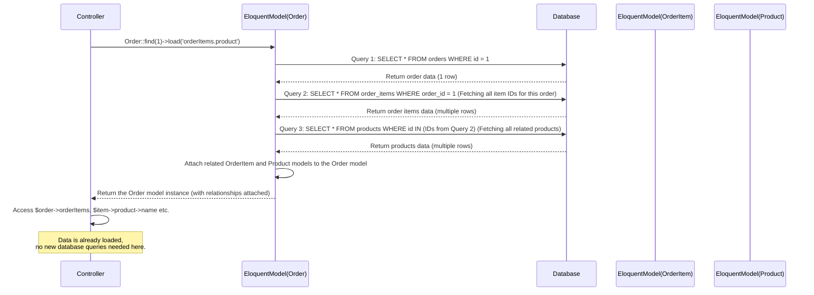

# Chapter 5: E-commerce Models (Product, Category, Order, OrderItem)

Welcome back! In the last chapter, [Eloquent Models](04_eloquent_models_.md), we learned the fundamental concept of Eloquent Models as the powerful bridge between your PHP code and the database. You saw how a generic `Model` class helps you fetch, save, update, and delete data easily without writing raw SQL queries.

Now, let's apply that knowledge to the heart of our e-commerce project! An online store deals with specific types of data: the items for sale, how they are organized, and the details of customer purchases. This is where our **E-commerce Models** come in.

These are not special types of models in terms of *how* they work (they are still standard Eloquent Models), but they represent the core business data of our store. They are `Product`, `Category`, `Order`, and `OrderItem`.

Think of them as the key players on your e-commerce stage. The database is the backstage storage, and these models are the actors who retrieve and manage the props (the data) for the show (your website).

In simpler terms, these E-commerce Models answer the question: **"What are the main pieces of information our store needs to keep track of, and how are they connected?"**

## What are the Core E-commerce Models?

Let's quickly introduce our main characters:

*   **`Product`**: This model represents a single item that you sell. It holds details like the product's name, description, price, stock quantity, images, etc. In the database, this corresponds to the `products` table.
*   **`Category`**: This model represents a group that products can belong to, like "Electronics," "Clothing," or "Books." It helps organize your store. In the database, this corresponds to the `categories` table.
*   **`Order`**: This model represents a completed purchase made by a customer. It stores overall information about the transaction, such as the total amount, status (pending, shipped, etc.), billing and shipping addresses, and which user placed the order. In the database, this corresponds to the `orders` table.
*   **`OrderItem`**: An `Order` is made up of one or more items. This model represents a single line item *within* a specific order. For example, if an order is for 2 t-shirts and 1 pair of socks, the `Order` would have two `OrderItem`s associated with it: one for the t-shirts (quantity 2) and one for the socks (quantity 1). It also records the price at the time of the order. In the database, this corresponds to the `order_items` table.

These four models, along with the `User` model (which you might be familiar with if you used Laravel's authentication scaffolding), form the fundamental data structure for our e-commerce platform.

## Inside the E-commerce Models

Just like the generic Model we saw in Chapter 4, these specific models are PHP classes in `app/Models` that extend `Illuminate\Database\Eloquent\Model`.

Let's look at a few key properties and methods you'll find in them, building on what we learned about Model anatomy.

### Defining Fillable Fields (`$fillable`)

All these models use the `$fillable` property to control which database columns can be safely assigned data in bulk (like when creating or updating a model with an array from a form).

From `app/Models/Product.php`:
```php
// File: app/Models/Product.php (snippet)
class Product extends Model
{
    // ... use HasFactory ...

    protected $fillable = [
        'name',
        'slug',
        'description',
        'short_description',
        'price',
        'sale_price',
        'stock_quantity',
        'sku',
        'images', // This will store image filenames, often as JSON
        'category_id', // Links to the category
        'is_active',
        'is_featured'
    ];

    // ... other properties and methods ...
}
```
This lists the columns in the `products` table (`database/migrations/2025_07_05_183423_create_products_table.php`) that we intend to set via mass assignment.

You'll find similar `$fillable` arrays in `app/Models/Category.php`, `app/Models/Order.php`, and `app/Models/OrderItem.php`, listing the columns relevant to their respective tables.

### Casting Data (`$casts`)

The `$casts` property is particularly useful in e-commerce models to handle specific data types.

From `app/Models/Product.php`:
```php
// File: app/Models/Product.php (snippet)
class Product extends Model
{
    // ... use HasFactory, $fillable ...

    protected $casts = [
        'images' => 'array', // Database column stores JSON string, Model returns PHP array
        'is_active' => 'boolean', // Database 0/1 becomes PHP false/true
        'is_featured' => 'boolean',
        'price' => 'decimal:2', // Ensures price is treated as decimal with 2 places
        'sale_price' => 'decimal:2'
    ];

    // ... other properties and methods ...
}
```
This ensures that when you retrieve a product, the `images` property is automatically an array you can loop through in your [Blade Views](03_blade_views_.md), and `is_active` is a proper boolean (`true` or `false`) for easy conditional checks (`@if ($product->is_active)`). Price fields are also handled correctly as decimals.

`Category` uses `$casts` for `is_active` and `Order` might use it for the JSON address fields.

### Calculated Properties (Accessors)

We saw this briefly in Chapter 4 with `getCurrentPriceAttribute`.

From `app/Models/Product.php`:
```php
// File: app/Models/Product.php (snippet)
class Product extends Model
{
    // ... properties and relationships ...

    // Accessor for getting the effective price (sale_price if available, else price)
    // Access with $product->current_price
    public function getCurrentPriceAttribute()
    {
        return $this->sale_price ?? $this->price;
    }

    // ... other methods ...
}
```
This is a simple but powerful example of adding application logic directly to the Model. Any code that needs to know the *current* price of a product (considering sales) can just access `$product->current_price` instead of repeating the `if (sale_price) ... else ...` logic everywhere.

## The Power of Relationships (Connecting the Data)

This is where E-commerce Models truly shine together. They are not isolated; they are connected! Eloquent relationships (as introduced in Chapter 4) make it easy to navigate these connections.

Let's look at the key relationships in our project:

### Product and Category (One-to-Many)

*   A **Category** can have many **Products**.
*   A **Product** belongs to one **Category**.

**In the `Category` Model (`app/Models/Category.php`):**
```php
// File: app/Models/Category.php (snippet)
class Category extends Model
{
    // ... properties ...

    // A Category has many Products
    public function products()
    {
        return $this->hasMany(Product::class);
    }
}
```
If you have a `$category` object (e.g., fetched using `Category::find(1)`), you can get all products belonging to it like this: `$productsInCategory = $category->products;`. `$productsInCategory` will be an Eloquent Collection of `Product` models.

**In the `Product` Model (`app/Models/Product.php`):**
```php
// File: app/Models/Product.php (snippet)
class Product extends Model
{
    // ... properties ...

    // A Product belongs to a Category
    public function category()
    {
        return $this->belongsTo(Category::class);
    }

    // ... other methods ...
}
```
If you have a `$product` object (e.g., fetched using `Product::find(5)` or via Route Model Binding), you can get the category it belongs to like this: `$theCategory = $product->category;`. `$theCategory` will be a single `Category` model object. You can then access its properties, like `$theCategory->name`.

Using these relationship methods, you can easily display a product's category on its detail page or list all products for a given category page, without writing join queries yourself.

### Order, OrderItem, and Product/User (Many-to-One, One-to-Many)

These models represent the transaction data.

*   An **Order** belongs to a **User**.
*   An **Order** has many **OrderItem**s.
*   An **OrderItem** belongs to an **Order**.
*   An **OrderItem** belongs to a **Product** (this links the item back to the specific product details).

**In the `Order` Model (`app/Models/Order.php`):**
```php
// File: app/Models/Order.php (snippet)
class Order extends Model
{
    // ... properties ...

    // An Order belongs to a User
    public function user()
    {
        return $this->belongsTo(User::class);
    }

    // An Order has many OrderItems
    public function orderItems()
    {
        return $this->hasMany(OrderItem::class);
    }

    // ... other methods ...
}
```
If you have an `$order` object, you can get the user who placed it (`$order->user`) or get a collection of all items in that order (`$order->orderItems`).

**In the `OrderItem` Model (`app/Models/OrderItem.php`):**
```php
// File: app/Models/OrderItem.php (snippet)
class OrderItem extends Model
{
    // ... properties ...

    // An OrderItem belongs to an Order
    public function order()
    {
        return $this->belongsTo(Order::class);
    }

    // An OrderItem belongs to a Product
    // Note: This links the item back to the Product model to get details like name, etc.
    public function product()
    {
        return $this->belongsTo(Product::class);
    }

    // ... other methods ...
}
```
If you have an `$orderItem` object, you can get the order it belongs to (`$orderItem->order`) or the product it refers to (`$orderItem->product`).

These relationships allow you to build complex views, like displaying a user's order history (`$user->orders`), showing all the items within a specific order (`$order->orderItems`), and for each item, showing the product's name and image (`$orderItem->product->name`, `$orderItem->product->images[0]`).

## Using E-commerce Models in Practice

Let's look at simple examples of how Controllers use these models and their relationships, and how [Blade Views](03_blade_views_.md) then display the data.

### Example 1: Displaying Products on the Homepage

In `HomeController@index` (Chapter 2), we needed to show featured products and categories.

```php
// File: app/Http/Controllers/HomeController.php (snippet)

use App\Models\Product;
use App\Models\Category;
// ...

public function index()
{
    $featuredProducts = Product::where('is_featured', true) // Use Model query
        ->where('is_active', true)
        ->with('category') // **Eager load** the category relationship!
        ->take(8)
        ->get(); // Get a Collection of Product models

    $categories = Category::where('is_active', true)
        ->withCount('products') // **Eager load** the count of products
        ->take(6)
        ->get(); // Get a Collection of Category models

    // ... latest products query ...

    return view('home', compact('featuredProducts', 'categories', 'latestProducts'));
}
```

*   `Product::where(...)`: Uses the static query methods on the `Product` model.
*   `->with('category')`: This is called **eager loading**. It tells Eloquent to fetch the related `category` for *all* the selected products in *one* extra query, rather than running a separate query for *each* product when you access `$product->category` in the view. This is much more efficient!
*   `Category::where(...)`: Uses the `Category` model.
*   `->withCount('products')`: Eager loads the count of related products for each category efficiently.

The `home.blade.php` [View](03_blade_views_.md) then receives the `$featuredProducts` and `$categories` collections and loops through them, accessing properties and relationships:

```html
{{-- File: resources/views/home.blade.php (snippet) --}}

{{-- Loop through featured products --}}
@foreach($featuredProducts as $product)
    <div>
        <h3>{{ $product->name }}</h3>
        <p>Category: {{ $product->category->name }}</p> {{-- Accessing the category relationship --}}
        <p>Price: ${{ $product->current_price }}</p> {{-- Accessing the accessor --}}
    </div>
@endforeach

{{-- Loop through categories --}}
@foreach($categories as $category)
    <div>
        <h4>{{ $category->name }}</h4>
        {{-- Accessing the product count loaded with withCount --}}
        <p>{{ $category->products_count }} products</p>
    </div>
@endforeach
```

This shows how Controllers use the Models to fetch structured data, including related data, and pass it to the Views for display.

### Example 2: Displaying a Single Order

In `OrderController@show`, we need to display the details of one order, including all the items purchased.

```php
// File: app/Http/Controllers/OrderController.php (snippet)

use App\Models\Order;
// ...

// Using Route Model Binding (Chapter 2/4) - $order is already the correct Order model
public function show(Order $order)
{
    // We need the order items AND the product details for each item.
    // Eager load the 'orderItems' relationship, AND within that,
    // eager load the 'product' relationship for each item!
    $order->load('orderItems.product');

    // Pass the $order (now with loaded relationships) to the view
    return view('orders.show', compact('order'));
}
```

*   `$order->load('orderItems.product')`: This is another way to eager load relationships, often used when you already have the model instance. `orderItems.product` means "load the `orderItems` relationship on the `$order`, and then for each of those `orderItems`, load their `product` relationship."

The `orders/show.blade.php` [View](03_blade_views_.md) receives the `$order` object and loops through its `orderItems`:

```html
{{-- File: resources/views/orders/show.blade.php (snippet) --}}

<h1>Order #{{ $order->order_number }}</h1>
<p>Total: ${{ $order->total_amount }}</p>

<h2>Items</h2>
<ul>
    {{-- Loop through the order's items --}}
    @foreach($order->orderItems as $item)
        <li>
            {{-- Access the product relationship from the OrderItem --}}
            {{ $item->product->name }}
            ({{ $item->quantity }} x ${{ $item->price }})
            - Total: ${{ $item->total }}
        </li>
    @endforeach
</ul>
```

This demonstrates how the `Order`, `OrderItem`, and `Product` models work together through their relationships to display the full details of a customer's purchase.

## How it Works Under the Hood (Loading Relationships)

When you access a relationship like `$product->category` or `$order->orderItems`, Eloquent doesn't automatically load the related data *until* you try to access it. This is called **lazy loading**. While convenient, it can be inefficient if you access the same relationship on many models in a collection (the "N+1 problem").

That's why we use **eager loading** with `with()` or `load()`. Eloquent is smart about this:



By using `with()` or `load()`, you trigger additional, optimized queries *upfront* to fetch all needed related data, avoiding many individual database calls later when you access the relationships.

## Where to Find the Code

You can explore the full definitions of these E-commerce Models in the `app/Models` directory:

*   `app/Models/Product.php`
*   `app/Models/Category.php`
*   `app/Models/Order.php`
*   `app/Models/OrderItem.php`

Look for the `$fillable`, `$casts`, and the relationship methods (`belongsTo`, `hasMany`).

The structure of the database tables these models interact with is defined in the migration files in `database/migrations`:

*   `database/migrations/2025_07_05_183423_create_products_table.php`
*   `database/migrations/2025_07_05_183418_create_categories_table.php`
*   `database/migrations/2025_07_05_183432_create_orders_table.php`
*   `database/migrations/2025_07_05_183436_create_order_items_table.php`

These migrations show the columns (`string`, `text`, `decimal`, `integer`, `json`, `boolean`) and foreign key constraints (`foreignId('category_id')...constrained()`) that define the relationships at the database level, which Eloquent then uses in the Model relationship methods.

## Conclusion

The `Product`, `Category`, `Order`, and `OrderItem` models are the backbone of our e-commerce application's data layer. They extend the foundational concepts of [Eloquent Models](04_eloquent_models_.md) by representing the specific entities in our store and defining how they relate to each other. By understanding their properties (`$fillable`, `$casts`) and, most importantly, their relationships (`belongsTo`, `hasMany`), you can efficiently fetch and organize the complex data needed to power an online store.

You've now seen how [Routing](01_routing_.md) directs requests, [Controllers](02_controllers_.md) handle logic, [Blade Views](03_blade_views_.md) display information, and Eloquent Models (especially our e-commerce ones) manage the database data.

The next step in building a functional e-commerce site is managing users. How do we allow customers to register, log in, and ensure only they can see their orders? That's handled by the [Authentication System](06_authentication_system_.md)!

[Next Chapter: Authentication System](06_authentication_system_.md)

---
