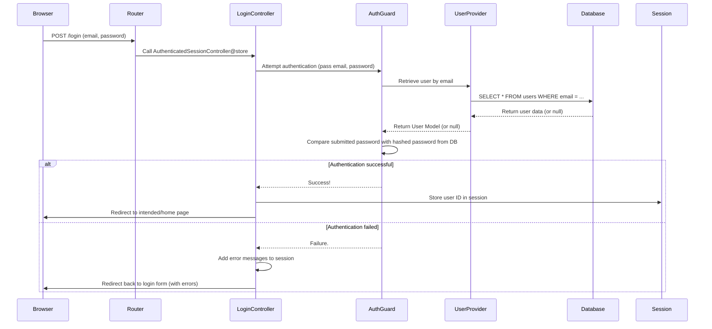
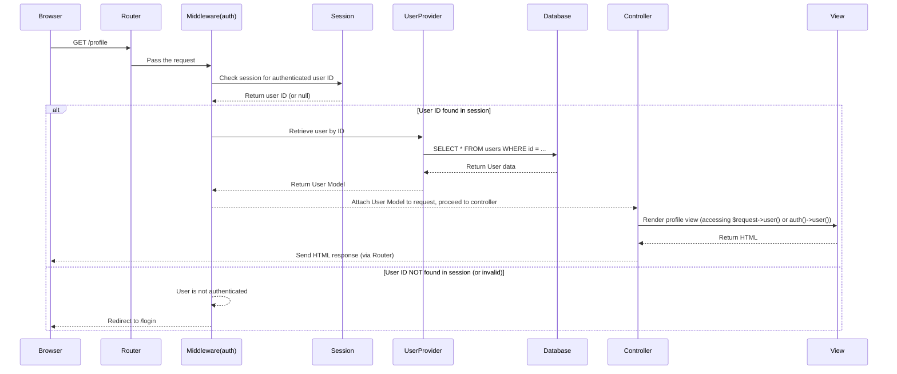

# Chapter 6: Authentication System

Welcome back! So far in our Laravel e-commerce journey, we've covered the fundamentals:
*   [Routing](01_routing_.md) directs incoming requests.
*   [Controllers](02_controllers_.md) handle the logic for those requests.
*   [Blade Views](03_blade_views_.md) display the information as HTML pages.
*   [Eloquent Models](04_eloquent_models_.md) and our specific [E-commerce Models (Product, Category, Order, OrderItem)](05_e_commerce_models__product__category__order__orderitem__.md) help us interact with the database.

But something big is missing: how do we know *who* is visiting our site? How do we allow customers to create accounts, log in to view their order history, or securely manage their profile?

This is the job of the **Authentication System**.

Think of it like the doorman and concierge service for your website. It handles who is allowed inside (logging in), helps new visitors sign up (registration), assists those who forgot their key (password reset), and remembers who is currently in the building so they can access private areas (like their profile page or, later, the admin panel).

In simpler terms, the Authentication System answers the question: **"How do we manage user accounts and know which specific user is currently using the application?"**

## What Authentication Provides

A robust authentication system is essential for features like:

*   **User Registration:** Allowing new users to create accounts.
*   **User Login:** Allowing existing users to sign in.
*   **User Logout:** Allowing users to end their session.
*   **Password Reset:** Helping users recover or change forgotten passwords via email.
*   **Email Verification:** Confirming that a user's email address is valid.
*   **Identifying the Current User:** Keeping track of who is logged in.
*   **Restricting Access:** Preventing unauthorized users from viewing certain pages or performing certain actions.

Building all this from scratch is complex and prone to security errors. Fortunately, Laravel provides powerful tools, and in this `laravel_ecommerce` project, much of this setup is handled automatically by a helpful package called **Laravel Breeze**.

Laravel Breeze provides a simple, minimal starting point for building authentication features, including the necessary routes, controllers, and views. You get a fully functional registration, login, password reset, and email verification flow ready to go!

## Key Components Working Together

Let's see how the pieces we've learned about (Routes, Controllers, Views, Models) come together to handle authentication, largely thanks to Laravel Breeze.

### 1. The User Model (`App\Models\User`)

At the core of authentication is the user data. Laravel uses the standard `App\Models\User` [Eloquent Model](04_eloquent_models_.md), which represents the `users` table in your database. This model includes fields like `name`, `email`, `password`, and `email_verified_at`.

```php
// File: app/Models/User.php (simplified snippet)

namespace App\Models;

// ... imports ...
use Illuminate\Foundation\Auth\User as Authenticatable; // Important trait!

class User extends Authenticatable // This class handles user authentication features
{
    use HasFactory, Notifiable, HasProfilePhoto, TwoFactorAuthenticatable; // Other traits

    // Fields that can be mass assigned (like when registering)
    protected $fillable = [
        'name',
        'email',
        'password',
        'role', // We added a role field for basic access control later
    ];

    // Fields hidden when converting model to array/JSON
    protected $hidden = [
        'password',
        'remember_token',
    ];

    // Fields that should be cast to native types
    protected $casts = [
        'email_verified_at' => 'datetime',
        'password' => 'hashed', // Laravel automatically hashes passwords!
        'Two-factor_confirmed_at' => 'datetime',
    ];

    // Accessor to easily check if a user is an admin
    public function isAdmin()
    {
        return $this->role === 'admin';
    }
}
```

The `Authenticatable` trait used by the `User` model provides Laravel's authentication features. Notice the `$casts` property includes `'password' => 'hashed'`. When you set the user's password using `$user->password = 'secret'`, Laravel automatically hashes it securely before saving it to the database! The `isAdmin()` method is a simple custom addition for our project's role-based features.

### 2. Authentication Routes (`routes/auth.php`)

Laravel Breeze places all the routes related to authentication in a separate file, `routes/auth.php`. This keeps your main `routes/web.php` clean.

```php
// File: routes/auth.php (simplified snippet)

use App\Http\Controllers\Auth\AuthenticatedSessionController;
// ... other Auth Controller imports ...
use Illuminate\Support\Facades\Route;

// Routes for guests (users who are NOT logged in)
Route::middleware('guest')->group(function () {
    Route::get('register', [RegisteredUserController::class, 'create'])->name('register'); // Show registration form
    Route::post('register', [RegisteredUserController::class, 'store']); // Handle registration form submission

    Route::get('login', [AuthenticatedSessionController::class, 'create'])->name('login'); // Show login form
    Route::post('login', [AuthenticatedSessionController::class, 'store']); // Handle login form submission

    // ... Password reset routes go here ...
});

// Routes for logged in users
Route::middleware('auth')->group(function () {
    // ... Email verification routes go here ...
    Route::post('logout', [AuthenticatedSessionController::class, 'destroy'])->name('logout'); // Handle logout
    // ... Password confirmation route goes here ...
    Route::put('password', [PasswordController::class, 'update'])->name('password.update'); // Change password
});
```

*   `Route::middleware('guest')`: This groups routes that should *only* be accessible to users who are *not* logged in. If a logged-in user tries to visit `/login` or `/register`, Laravel will automatically redirect them to the homepage (or another configured page).
*   `Route::middleware('auth')`: This groups routes that should *only* be accessible to users who *are* logged in. If a user who is *not* logged in tries to visit a route in this group (like `/profile` in `routes/web.php`), Laravel will automatically redirect them to the `/login` page.
*   Each route links a URL and HTTP method to a specific method in an Authentication [Controller](02_controllers_.md).

### 3. Authentication Controllers (`app/Http/Controllers/Auth/`)

These controllers contain the logic for the authentication process. Laravel Breeze provides several controllers in the `app/Http/Controllers/Auth/` directory.

*   `RegisteredUserController`: Handles showing the registration form and creating a new user.
*   `AuthenticatedSessionController`: Handles showing the login form, logging a user in, and logging a user out.
*   `PasswordResetLinkController` and `NewPasswordController`: Handle the forgotten password email and resetting the password.
*   `EmailVerificationPromptController` and `VerifyEmailController`: Handle the email verification process.

Let's look at simplified versions of a couple of methods:

**Handling Registration Submission (`RegisteredUserController@store`):**

```php
// File: app/Http/Controllers/Auth/RegisteredUserController.php (simplified snippet)

use App\Models\User;
use Illuminate\Http\Request;
use Illuminate\Support\Facades\Auth; // Used for logging the user in
use Illuminate\Support\Facades\Hash; // Used for hashing passwords

public function store(Request $request): RedirectResponse
{
    // 1. Validate the incoming form data
    $request->validate([
        'name' => 'required|string|max:255',
        'email' => 'required|string|lowercase|email|max:255|unique:'.User::class, // Ensure email is unique
        'password' => ['required', 'confirmed', Rules\Password::defaults()], // Password must match confirmation and meet security rules
    ]);

    // 2. Create the new user in the database
    $user = User::create([ // Uses the $fillable property in the User model
        'name' => $request->name,
        'email' => $request->email,
        'password' => Hash::make($request->password), // Manually hash if not using $casts
        'role' => 'user', // Set a default role
    ]);

    // 3. (Optional) Trigger registration events (e.g., sending verification email)
    event(new Registered($user));

    // 4. Log the new user in automatically
    Auth::login($user);

    // 5. Redirect the user after successful registration/login
    return redirect()->route('home'); // Or redirect based on role, as in the actual code
}
```

This shows the core steps: validate input, create the `User` model, log the user in, and redirect.

**Handling Login Submission (`AuthenticatedSessionController@store`):**

```php
// File: app/Http/Controllers/Auth/AuthenticatedSessionController.php (simplified snippet)

use App\Http\Requests\Auth\LoginRequest; // Custom Request for validation
use Illuminate\Http\RedirectResponse;
use Illuminate\Http\Request;
use Illuminate\Support\Facades\Auth;

public function store(LoginRequest $request): RedirectResponse
{
    // 1. Authenticate the user's credentials
    // The LoginRequest handles validation and the authentication attempt
    $request->authenticate();

    // 2. Regenerate the session ID for security (prevents session fixation attacks)
    $request->session()->regenerate();

    // 3. Redirect the user to their intended page (the page they tried to visit before logging in)
    // or to the homepage if there was no intended page.
    // The actual code redirects based on user role (admin vs user).
    if (auth()->user()->role === 'admin') {
        return redirect()->intended(route('admin.dashboard'));
    }
    return redirect()->intended(route('home'));
}
```

This demonstrates how the controller uses `$request->authenticate()` (handled by the `LoginRequest` validation class) to verify credentials and then logs the user in using the `Auth` facade.

### 4. Authentication Views (`resources/views/auth/`)

Laravel Breeze provides ready-made [Blade Views](03_blade_views_.md) for the different authentication screens.

*   `resources/views/auth/register.blade.php` (The registration form)
*   `resources/views/auth/login.blade.php` (The login form)
*   `resources/views/auth/forgot-password.blade.php`
*   `resources/views/auth/reset-password.blade.php`
*   `resources/views/auth/verify-email.blade.php`
*   `resources/views/auth/confirm-password.blade.php`

These views contain the HTML forms that users interact with.

**Simplified Login Form View (`resources/views/auth/login.blade.php` snippet):**

```html
{{-- File: resources/views/auth/login.blade.php (simplified snippet) --}}

{{-- This view uses a guest layout component provided by Breeze --}}
<x-guest-layout>

    {{-- Session Status messages (e.g., "You are logged out") --}}
    <x-auth-session-status class="mb-4" :status="session('status')" />

    {{-- The HTML form --}}
    <form method="POST" action="{{ route('login') }}">
        @csrf {{-- Important! Adds a security token to the form --}}

        <!-- Email Address Input -->
        <div>
            <label for="email">Email</label> {{-- Uses Blade Components in Breeze, simplified here --}}
            <input id="email" type="email" name="email" value="{{ old('email') }}" required autofocus />
            @error('email') <span class="text-danger">{{ $message }}</span> @enderror {{-- Display validation errors --}}
        </div>

        <!-- Password Input -->
        <div class="mt-4">
            <label for="password">Password</label>
            <input id="password" type="password" name="password" required />
            @error('password') <span class="text-danger">{{ $message }}</span> @enderror
        </div>

        <!-- Remember Me Checkbox -->
        <div class="block mt-4">
            <label for="remember_me">Remember me</label>
            <input id="remember_me" type="checkbox" name="remember">
        </div>

        <div class="flex items-center justify-end mt-4">
            <a href="{{ route('password.request') }}">Forgot your password?</a>
            <button type="submit">Log in</button>
        </div>
    </form>

</x-guest-layout>
```

*   `action="{{ route('login') }}"`: Uses the named route (`login`) defined in `routes/auth.php` to determine where to send the form data (which is the `AuthenticatedSessionController@store` method).
*   `@csrf`: A crucial Blade directive that adds a hidden input field containing a CSRF (Cross-Site Request Forgery) token. Laravel checks for this token on POST requests to ensure the request is coming from a valid form on your site.
*   `{{ old('email') }}`: A helper that pre-fills the email field if the form submission failed validation, so the user doesn't have to re-type their email.
*   `@error('email') ... @enderror`: A Blade directive to easily display validation error messages for a specific field (`email`).

These views collect the user's input and send it to the appropriate controller methods via the routes.

### 5. Authentication Middleware (`auth` and `guest`)

Middleware (we'll cover [Admin Middleware](08_admin_middleware_.md) more later) are like filters or checkpoints for requests. The `auth` middleware checks if the user is logged in. The `guest` middleware checks if the user is *not* logged in.

As seen in `routes/auth.php`, the `@middleware` directives on the route groups enforce these checks. You'll also see the `auth` middleware used in `routes/web.php` to protect parts of your application, like the profile page:

```php
// File: routes/web.php (snippet)

// ... other routes ...

// This group requires the user to be logged in ('auth' middleware)
Route::middleware('auth')->group(function () {
    // Routes for managing user profile
    Route::get('/profile', [ProfileController::class, 'edit'])->name('profile.edit');
    Route::patch('/profile', [ProfileController::class, 'update'])->name('profile.update');
    Route::delete('/profile', [ProfileController::class, 'destroy'])->name('profile.destroy');

    // Routes for checkout and orders also require login
    Route::get('/checkout', [CheckoutController::class, 'index'])->name('checkout.index');
    // ... other checkout and order routes ...
});

// ... rest of the routes ...
```

If a user who isn't authenticated tries to access `/profile`, the `auth` middleware intercepts the request and redirects them to the login page (`/login`).

### 6. Accessing the Logged-in User

Once a user is logged in, you can easily access their information anywhere in your application.

*   In Controllers or other PHP code:
    ```php
    use Illuminate\Support\Facades\Auth;

    // Get the current user model instance
    $user = Auth::user();

    // Or using the global helper function
    $user = auth()->user();

    // In a Controller method that receives the Request object
    public function index(Request $request)
    {
        $user = $request->user(); // Get the authenticated user from the request
        // ... use $user->name, $user->email, etc. ...
    }
    ```

*   In [Blade Views](03_blade_views_.md):
    ```html
    {{-- Check if a user is logged in --}}
    @auth
        {{-- Content shown only to logged-in users --}}
        <p>Welcome, {{ auth()->user()->name }}!</p>
        <p><a href="{{ route('profile.edit') }}">My Profile</a></p>
        <p><a href="{{ route('orders.index') }}">My Orders</a></p>
    @endauth

    {{-- Check if NO user is logged in (guest) --}}
    @guest
        {{-- Content shown only to guests --}}
        <p>Please <a href="{{ route('login') }}">log in</a> or <a href="{{ route('register') }}">register</a>.</p>
    @endguest

    {{-- Directly access the user if you know they are logged in (e.g., in an auth-protected view) --}}
    <h1>My Profile</h1>
    <p>Name: {{ auth()->user()->name }}</p>
    <p>Email: {{ auth()->user()->email }}</p>
    ```

This ability to easily identify and retrieve the currently logged-in user allows you to personalize content, show user-specific data (like their orders), and control access to features.

## How it Works Under the Hood (Simplified Login)

When a user submits the login form:



The **Auth Guard** (often the default 'web' guard using sessions) handles the core logic of verifying credentials and managing the user's session. The **User Provider** (by default, configured in `config/auth.php` to use the `Eloquent` driver and the `App\Models\User` model) is responsible for fetching user details from the database based on the identifier (like email).

## How it Works Under the Hood (Accessing Protected Page)

When a logged-in user requests a page protected by the `auth` middleware:



The `auth` middleware is executed *before* the request reaches the controller. It checks the session to see if a user is logged in. If they are, it fetches the `User` model and makes it available via the `Request` object or `auth()` helper. If not, it sends the user to the login page.

## Looking at the Code Files

The core files involved in Laravel Breeze authentication are:

*   `routes/auth.php`: Defines all the URLs and the Controller methods that handle them.
*   `app/Http/Controllers/Auth/`: Contains the PHP classes with the actual registration, login, and password logic.
*   `resources/views/auth/`: Contains the Blade template files for the authentication forms (login, register, etc.).
*   `app/Models/User.php`: The Eloquent Model representing users.
*   `config/auth.php`: Configuration file defining guards, user providers, password brokers, etc. (You usually don't need to change this for basic setup).
*   `database/migrations/*_create_users_table.php`: Defines the structure of the `users` table in the database.

You might also see layout components provided by Breeze in `resources/views/components/auth-session-status.blade.php` or `resources/views/components/input-error.blade.php`, which help display status messages and validation errors in the auth views.

## Conclusion

The Authentication System is a vital part of our e-commerce application, allowing us to manage user accounts and identify logged-in customers. Laravel Breeze provides a fantastic head start, setting up the necessary routes, controllers, views, and underlying logic almost automatically. You've learned how the `User` model, dedicated auth routes and controllers, Blade views, and the `auth`/`guest` middleware work together to handle registration, login, logout, and protect parts of your site.

Now that we know how to manage users and identify who is logged in, we can start building features that are specific to that user. A prime example is the shopping cart, where a logged-in user's cart can be saved between visits. Let's explore how our e-commerce site manages the cart in the next chapter using a powerful Laravel feature called a Facade!

[Next Chapter: Cart Management (using Facade)](07_cart_management__using_facade__.md)

---
