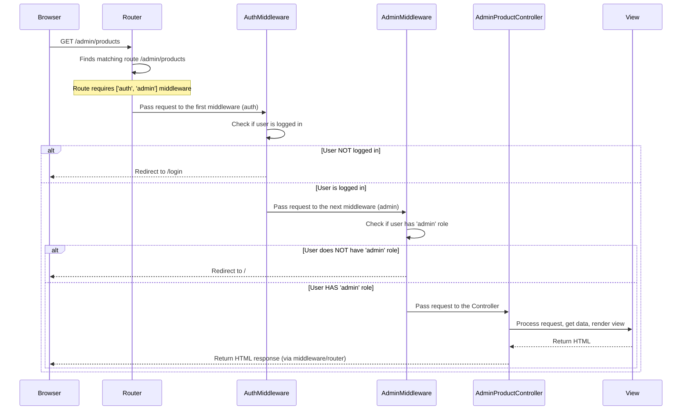

# Chapter 8: Admin Middleware

Welcome back! In the previous chapter, [Cart Management (using Facade)](07_cart_management__using_facade__.md), we learned how to build a dynamic shopping cart experience, allowing users to add, update, and remove items from their temporary list of products using a convenient `Cart` Facade. This relies on knowing who the user is, thanks to the [Authentication System](06_authentication_system_.md) we covered earlier.

Now, let's think about the administrative side of our e-commerce site. The admin panel allows us to manage products, categories, view orders, and perform other sensitive tasks. Naturally, we don't want just *anyone* to be able to access these pages. Only authorized administrators should have permission.

How do we put a "security checkpoint" in front of all the admin pages to check if the user trying to access them has the necessary permissions?

This is a perfect job for **Middleware**.

Think of Middleware as a series of filters or guardians that incoming requests must pass through before they reach the part of your application that actually handles the request (like a [Controller](02_controllers_.md) method). Each middleware does a specific job – maybe logging information, adding a header, or, in our case, checking if a user is authenticated and authorized.

Our **Admin Middleware** is a specific guardian designed to protect the admin sections of the site. Its job is simple: check if the currently logged-in user has the `'admin'` role. If they do, the request is allowed to continue to the intended admin page. If they don't (or if they aren't even logged in), the middleware blocks the request and redirects them away, ensuring only authorized administrators can access these sensitive areas.

In simpler terms, Admin Middleware answers the question: **"Is the person trying to access this admin page actually an administrator?"**

## What the Admin Middleware Does

The core function of our Admin Middleware is to implement a two-step security check for any route it's applied to:

1.  **Check if the user is logged in:** If someone tries to access an admin page without being logged in at all, they should be redirected to the login page. Admin access requires *being* a user first.
2.  **Check if the logged-in user is an administrator:** If they are logged in, the middleware then checks if their `role` (from the `users` database table, accessible via the `User` model from [Authentication System](06_authentication_system_.md)) is set to `'admin'`. If the role is something else (like `'user'`), they are not allowed access and should be redirected elsewhere, perhaps the homepage, with an error message.

Only if *both* of these checks pass will the middleware allow the request to proceed to the intended destination, like an Admin [Controller](02_controllers_.md) method that displays a list of products or shows the admin dashboard.

## Implementing the Admin Middleware

Middleware in Laravel are PHP classes. Our Admin Middleware is defined in the file `app/Http/Middleware/AdminMiddleware.php`.

Let's look at the core part of this file, the `handle` method:

```php
// File: app/Http/Middleware/AdminMiddleware.php (snippet)

namespace App\Http\Middleware;

use Closure;
use Illuminate\Http\Request;
use Symfony\Component\HttpFoundation\Response;

class AdminMiddleware
{
    public function handle(Request $request, Closure $next): Response
    {
        // Check 1: Is the user logged in?
        if (!auth()->check()) {
            // If not logged in, redirect to the login page
            return redirect()->route('login')->with('error', 'Please login first.');
        }

        // Check 2: Does the logged-in user have the 'admin' role?
        // We are using the isAdmin() method we added to the User model (Chapter 6)
        if (!auth()->user()->isAdmin()) {
             // If not an admin, redirect to homepage with error
            return redirect()->route('home')->with('error', 'Access denied. Admin privileges required.');
        }

        // If both checks pass, let the request continue to the intended destination
        return $next($request);
    }
}
```

*   `handle(Request $request, Closure $next)`: Every middleware class must have a `handle` method. It receives the incoming `$request` object and a `$next` closure. The `$next` closure represents the next item in the middleware chain (or the final destination, the controller).
*   `!auth()->check()`: This uses the `auth()` helper function to check if there is currently any authenticated user. The `!` negates it, so `!auth()->check()` is true if *no* user is logged in.
*   `redirect()->route('login')`: If the user isn't logged in, we use the `redirect()` helper to create a redirect response. `route('login')` generates the URL for the login page using the named route defined by [Laravel Breeze's Authentication System](06_authentication_system_.md). `.with('error', ...)` adds a temporary flash message to the session to inform the user why they were redirected.
*   `!auth()->user()->isAdmin()`: If the first check passes (the user is logged in), this checks if the logged-in user (`auth()->user()`) is an admin using the `isAdmin()` method we added to our `User` model in [Chapter 6: Authentication System](06_authentication_system_.md).
*   `redirect()->route('home')`: If the user is logged in but not an admin, they are redirected to the homepage (`home` named route) with a different error message.
*   `return $next($request)`: This is the crucial line that allows the request to continue down the middleware chain. If we reach this line, it means both security checks passed, and the original request is allowed to proceed to the intended [Controller](02_controllers_.md) method or the next middleware in the sequence.

## Registering the Middleware

Before we can use our `AdminMiddleware`, Laravel needs to know about it. Middleware needs to be registered, usually in the `app/Http/Kernel.php` file.

We need to give our middleware a short key or alias so we can easily refer to it when defining routes. In `Kernel.php`, look for the `$middlewareAliases` property.

```php
// File: app/Http/Kernel.php (simplified snippet)

namespace App\Http;

use Illuminate\Foundation\Http\Kernel as HttpKernel;

class Kernel extends HttpKernel
{
    // ... other properties ...

    /**
     * The application's route middleware aliases.
     *
     * These middleware may be assigned to groups or used individually.
     *
     * @var array<string, class-string|\Illuminate\Contracts\Http\Middleware\Alias>
     */
    protected $middlewareAliases = [
        // ... other aliases like 'auth', 'guest', 'verified' ...
        'admin' => \App\Http\Middleware\AdminMiddleware::class, // <-- Our Admin Middleware!
    ];

    // ... rest of the class ...
}
```

By adding `'admin' => \App\Http\Middleware\AdminMiddleware::class`, we tell Laravel that whenever we use the short name `'admin'` in a route definition, it should execute the code in the `handle` method of the `App\Http\Middleware\AdminMiddleware` class.

*(Note: If you generated this middleware using an Artisan command like `php artisan make:middleware AdminMiddleware`, Laravel might have automatically added this alias for you.)*

## Using the Admin Middleware on Routes

Now that the middleware is implemented and registered, we can apply it to the routes we want to protect. We typically want to protect *all* the routes that lead to the admin panel.

In [Chapter 1: Routing](01_routing_.md), we saw how to group routes that share common attributes. The admin routes were already grouped and had middleware applied. Let's look at that section of `routes/web.php` again:

```php
// File: routes/web.php (Admin Routes snippet)

// ... other routes above ...

// Admin Routes Group
Route::middleware(['auth', 'admin'])->prefix('admin')->name('admin.')->group(function () {
    // This route shows the admin dashboard
    Route::get('/', function () {
        return view('admin.dashboard');
    })->name('dashboard');

    // Resource routes for managing Categories, Products, Orders
    // These routes will also be protected by 'auth' and 'admin' middleware
    Route::resource('categories', AdminCategoryController::class);
    Route::resource('products', AdminProductController::class);
    Route::resource('orders', AdminOrderController::class)->only(['index', 'show', 'update']);
});

// ... other routes below ...
```

The key part here is `Route::middleware(['auth', 'admin'])`. This tells Laravel that *any* request attempting to reach a route *within this group* must first pass through two middleware, in this order:

1.  `auth`: Laravel's built-in middleware (from [Authentication System](06_authentication_system_.md)) that checks if the user is logged in. If not, it redirects to the login page.
2.  `admin`: Our custom middleware that checks if the logged-in user has the `'admin'` role. If not, it redirects to the homepage.

The request will only proceed to the `function()` that returns the view or one of the Admin [Controller](02_controllers_.md) methods (`AdminCategoryController`, `AdminProductController`, `AdminOrderController`) if *both* the `auth` and `admin` middleware allow it.

This is how we effectively secure the entire `/admin` section of our e-commerce site!

## How it Works Under the Hood (Simplified)

When a user tries to access an admin page like `/admin/products`, here's the simplified flow including our middleware:



The middleware act as a pipeline. The request enters the pipeline, each middleware performs its check, and only if all middleware pass the request (`$next($request)`) does it reach the final destination (the Controller). If any middleware redirects or returns a response, the pipeline is stopped, and that response is sent back immediately.

## Looking at the Code Files

The main files involved with Admin Middleware are:

*   `app/Http/Middleware/AdminMiddleware.php`: Contains the actual logic for the admin role check.
*   `app/Http/Kernel.php`: Where the `'admin'` middleware alias is registered.
*   `routes/web.php`: Where the `['auth', 'admin']` middleware is applied to the admin route group.
*   `app/Models/User.php`: Contains the `isAdmin()` method used by the middleware (covered in [Chapter 6: Authentication System](06_authentication_system_.md)).

By examining these files, you can see how the security layer for the admin panel is put in place using this simple yet powerful middleware.

## Conclusion

Middleware is a fundamental concept in Laravel for filtering and inspecting HTTP requests. Our custom Admin Middleware provides a crucial security layer for the administrative sections of our e-commerce site by ensuring that only authenticated users with the `'admin'` role can access those routes. You've learned how middleware classes work, how they are registered, and how to apply them to routes or route groups using the `middleware()` method.

This concludes our exploration of the core concepts used in the `laravel_ecommerce` project! You now have a foundational understanding of how requests are handled (Routing), processed (Controllers), displayed (Views), interact with data (Eloquent Models), manage users (Authentication), handle temporary data (Cart Management), and control access (Middleware).

You now have the knowledge to delve deeper into the project's code, understand how its different parts connect, and even begin customizing or adding new features. Good luck with your continued learning journey!

---
