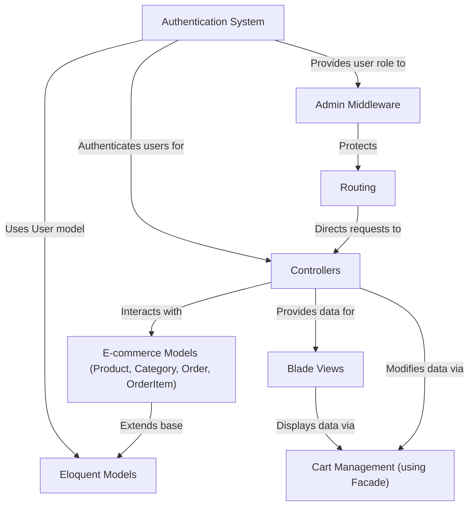

# Tutorial: laravel_ecommerce

This project is a **Laravel e-commerce website** where users can *browse products* and categories, add items to a *shopping cart*, and complete purchases through a *checkout* process. It includes a *user authentication system* for managing accounts and viewing *order history*. An *admin panel*, protected by *middleware*, allows administrators to manage products, categories, and orders.

## Visual Overview

## Chapters

1. [Routing
](01_routing_.md)
2. [Controllers
](02_controllers_.md)
3. [Blade Views
](03_blade_views_.md)
4. [Eloquent Models
](04_eloquent_models_.md)
5. [E-commerce Models (Product, Category, Order, OrderItem)
](05_e_commerce_models__product__category__order__orderitem__.md)
6. [Authentication System
](06_authentication_system_.md)
7. [Cart Management (using Facade)
](07_cart_management__using_facade__.md)
8. [Admin Middleware
](08_admin_middleware_.md)

---
## License

The Laravel framework is open-sourced software licensed under the [MIT license](https://opensource.org/licenses/MIT).
